# Raspberry Pi

With the addition of an [\#RFM12Pi](#RFM12Pi "wikilink") expansion
board, a Raspberry Pi running [emoncms](http://emoncms.org) can be used
as a powerful [emonBase](http://openenergymonitor.org/emon/emonbase)
base-station to log, process and visualise energy, temperature and other
environmental data.

Data can be logged locally to the Raspberry Pi's SD card and/or to a
remote emoncms server. Emoncms graphs and dashboards can be served from
the Raspberry Pi's web-server.

### RFM12Pi

The RFM12Pi GPIO expansion board enables the Raspberry Pi to receive or
transmit data via RFM12B wireless (433/868/915MHz) from other
[OpenEnergyMonitor modules](http://openenergymonitor.org/emon/Modules/)
such an an [emonTx](http://openenergymonitor.org/emon/emontx) energy and
temperature monitoring node, or an
[emonGLCD](http://openenergymonitor.org/emon/emonglcd) display. The
RFM12Pi expansion board can be purchased from the [OpenEnergyMonitor
shop](http://shop.openenergymonitor.com/raspberry-pi/)

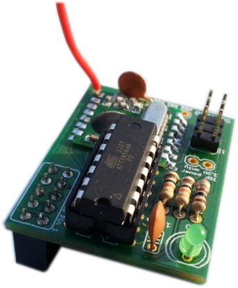

## For the new pre-assembled RFM12Pi V2 [ see new documentation](RFM12Pi_V2 "wikilink")

### Technical Overview

The RFM12Pi is uses an ATtiny84 microcontroller running a modified
version of [JeeLabs
RF12Demo](https://github.com/jcw/jeelib/tree/master/examples/RF12/RF12demo)
to receive wireless data via an RFM12B wireless transceiver and transmit
data via the Pi's internal serial port

The RFM12Pi board and much of the software is the work of [Martin
Harizanov](http://harizanov.com/wiki/wiki-home/rfm2pi-board/). We worked
with Martin on the hardware design and emoncms software integration. We
owe Martin a big thank you for the effort put into making this solution
work well.

### Design Files & Part List

| Quantity | Part                                |
| -------- | ----------------------------------- |
| 1x       | ATtiny84 (RF12B firmware preloaded) |
| 2x       | 100nF                               |
| 1x       | 5mm LED                             |
| 2x       | 10K (brown, black, orange, gold)    |
| 1 x      | 100R (brown, black, brown, gold)    |
| 1x       | RFM12B (433/868 Mhz)                |
| 1x       | GPIO 6x2 pin header female socket   |
| 1x       | ISP 3x2 pin header                  |
|          |                                     |

The RFM12Pi's Eagle CAD PCB design files, schematic and Arduino based
firmware can be downloaded from [Martin Harizanov's
GitHub](https://github.com/mharizanov/RFM2Pi)

## 1\) RFM12Pi Assembly

**It's recommended you read this guide and familiarise yourself with the
steps before you start the build.**

**Step 1 - Identify Components and Kit Contents**

Lay out, and identify, the components from the kit.

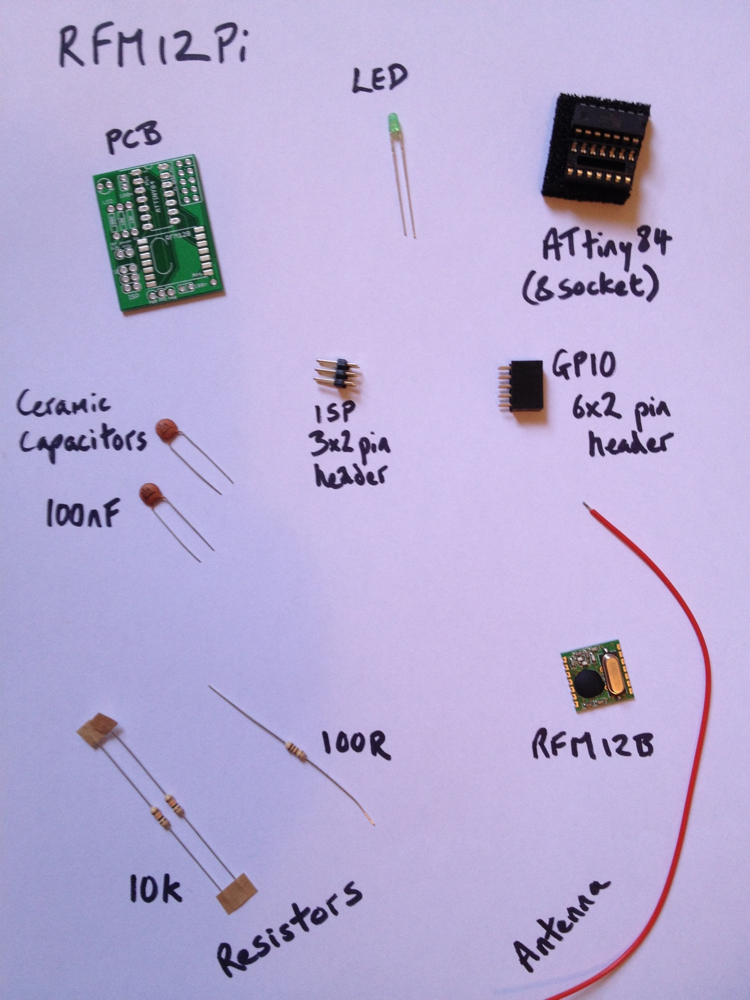

Ok, we're ready to start. Here is the PCB:

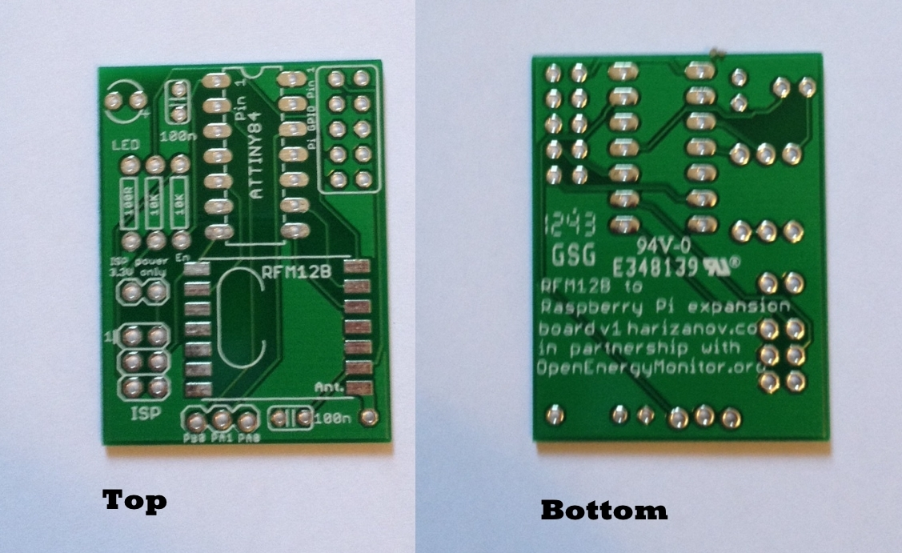

**Step 2 - 10k Resistors**

As a general principle we're going to build up from the lowest-profile
component. Start with the resistors. Bend each leg of the resistor 90
degrees, right next to the body. The last colour on all of the resistors
is brown - it's recommended that you align them all in the same
direction and have the brown at the same end. The colours for the 10K
resistor are (brown, black, orange, gold).

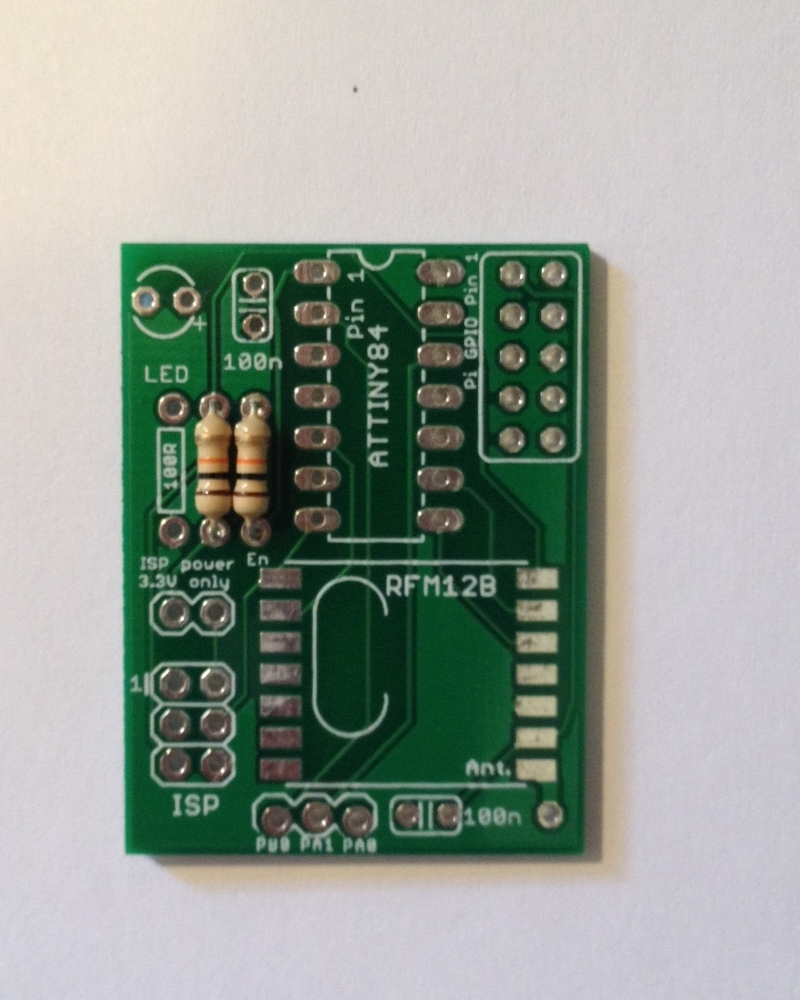

**Step 3 - 100R Resistor**

Add the 100R resistor in exactly the same way, its colours are (brown,
black, brown, gold)

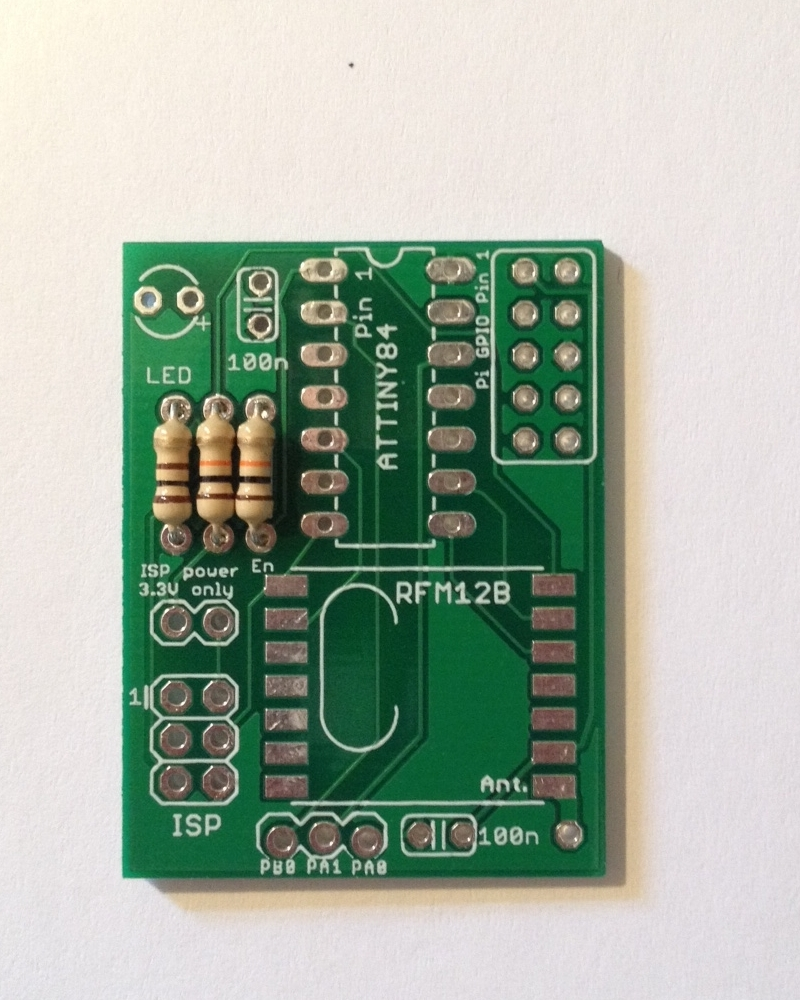

**Step 4 - ATtiny84 DIL Socket**

Fit the ATtiny84 DIL Socket as shown in the picture. Note that one end
has a small notch in it - this signifies pin 1 and should match up with
the notch on the PCB silkscreen. Make sure the socket is fitted flat on
the board.

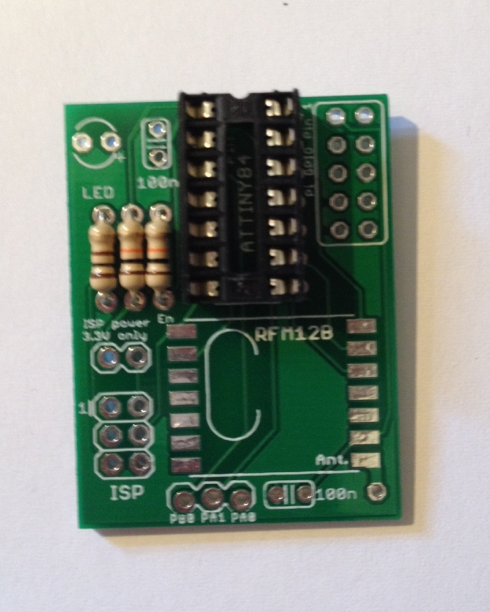

**Step 5 - Green LED**

Add the green LED. Ensure the long leg (and round edge) are facing the +
symbol printed on the board.

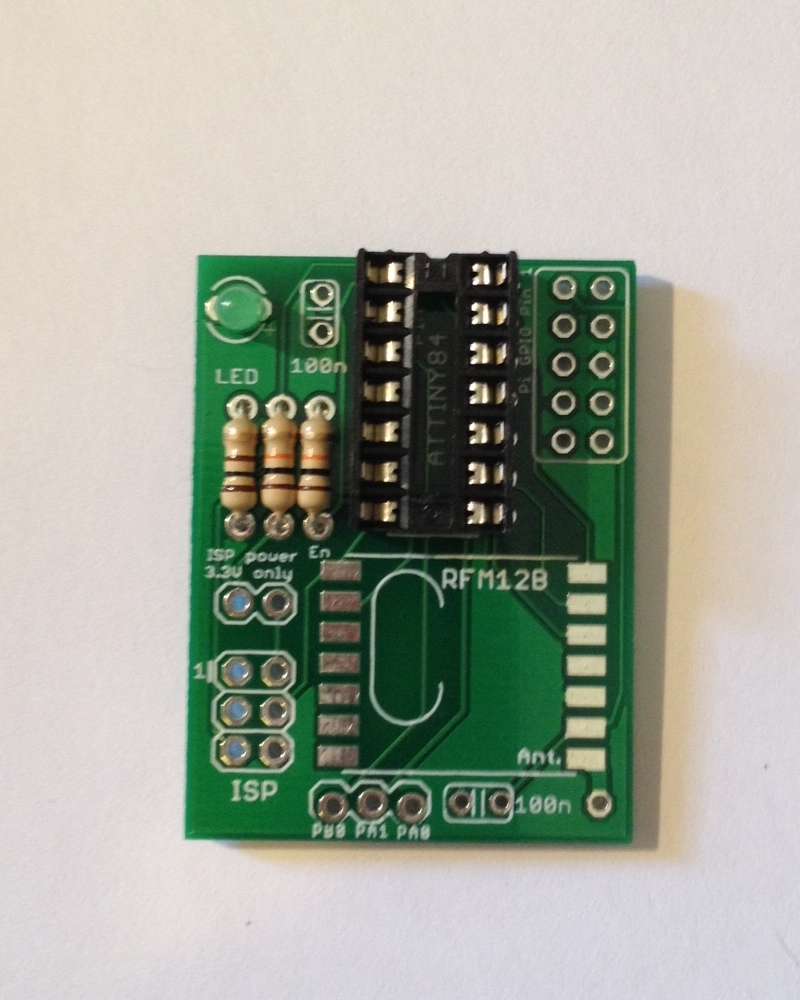

**Step 6 - RFM12B RF**

Place the RFM12BRF module on the pads (observe the orientation - Crystal
on the LEFT) and solder each pad to the board.

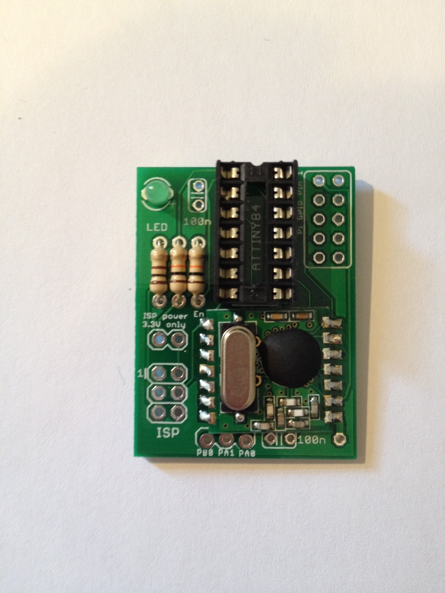

**Step 7 - 100nF Ceramic Capacitors**

Add the two 100nF ceramic capacitors one at either end of the board.

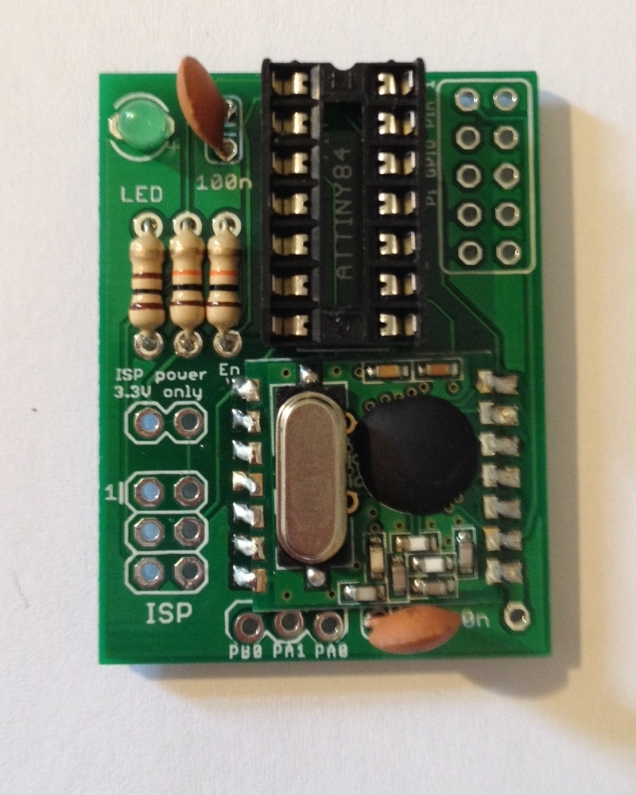

**Step 8 - 3x2 pin ISP header**

Add the 3x2 pin ISP header. Long pins point up, short pins are soldered
to the board.

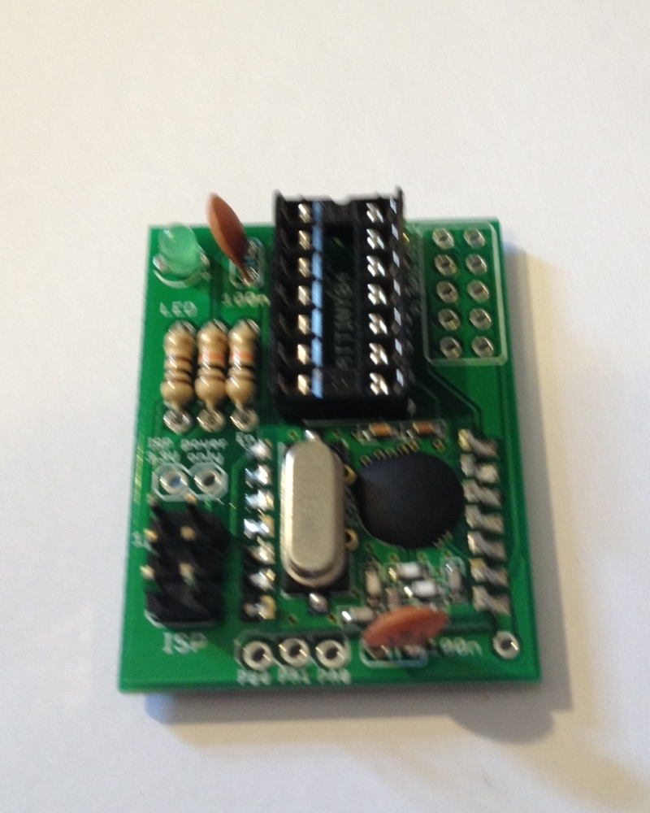

**Step 9 - 6x2 pin GPIO header female socket**

The GPIO socket needs to go on the bottom of the board.

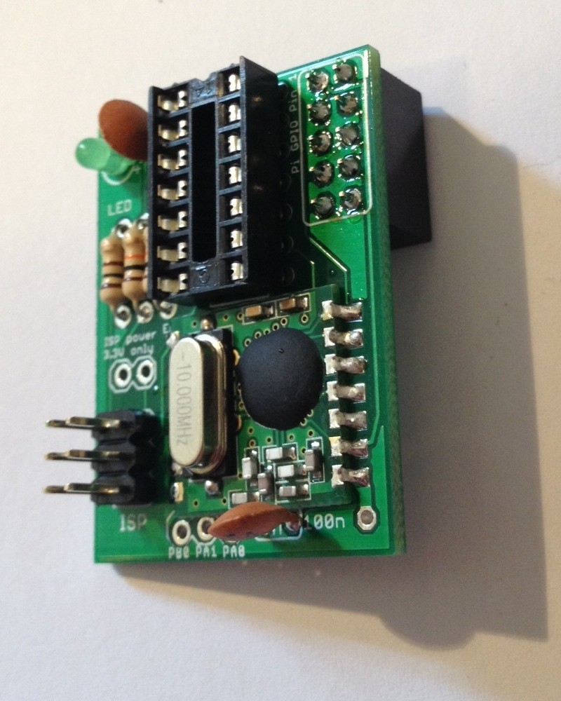

**Step 10 - RF Antenna**

Add the Antenna through the bottom-right hole, and solder it in place.
The length of the Antenna is dependant on the frequency of your RFM12B
module. This is a piece of wire 82mm long for 868MHz and 165mm for
433MHz which will act as a quarter-wave antenna. For more information on
the RFM12B see:
[1](http://openenergymonitor.org/emon/buildingblocks/rfm12b-wireless)

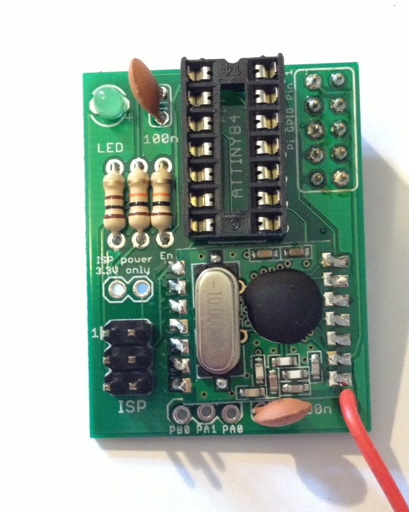

**Step 11 - ATtiny84 Integrated Circuit**

Fit the ATtiny84 IC into its socket. Note the spot next to pin 1 and
ensure you insert it the right way round.

ICs usually come with their legs pointing slightly outwards. To get them
to fit easily into the socket, put the legs flat on a desk and rock the
IC slightly to bend the pins inwards - do that to both sides and try to
fit it into the socket again.

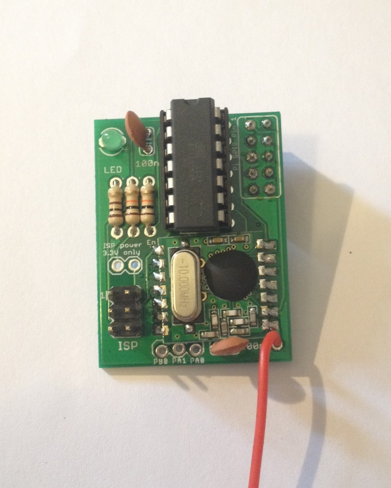

**Step 12 - Relax job done**

Turn off your soldering iron and go and have a cup of tea :-)

## (Optional) Bootload the ATtiny84

**The ATtiny84 microcontroller should come pre-loaded with the required
firmware (RFM12 Demo sketch). If you have obtained a blank ATtiny84
you'll need to upload the rf12 demo firmware to it:**

The 'easy' way to do this is to flash the pre compiled hex file onto the
ATtiny, this avoids the need to set up the Arduino IDE for an ATtiny,
getting the correct Arduino libraries, etc:

1.  Download the pre compiled RF12 demo .hex file from the firmware
    folder on [Mharizanov's RF12Pi Github
    Repo](https://github.com/mharizanov/RFM2Pi)
2.  Power the RF12Pi board with 3.3V, this can be done from the Pi
3.  If you have an AVR ISP MKII programmer simply connect it to the ISP
    header and run the following terminal commend:
      - `$ sudo avrdude -c avrispmkII -p t84 -P usb -e -Uefuse:w:0xFF:m
        -Uhfuse:w:0xD7:m -Ulfuse:w:0xE2:m -U
        flash:w:ATtiny84_RF12_Demo.cpp.hex`
      - This avrdude command sets the ATtiny fuses for internal 8Mhz
        crystal with the BOD disabled and flashes a pre-compiled RF12
        Demo sketch

Alternatively you can compile the RF12 Demo sketch yourself using
Arduino IDE:

1.  Setup Arduino 1.x IDE for operation with an ATtiny by following [our
    guide](http://openenergymonitor.org/emon/buildingblocks/attiny)
2.  Download a modified version (to use software serial on the ATtiny)
    of JeeLabs RF12 Demo from [Mharizanov's RF12Pi Github
    Repo](https://github.com/mharizanov/RFM2Pi)
3.  Ensure you have the latest JeeLabs [JeeLib Arduino
    library](https://github.com/jcw/jeelib) installed
4.  Power the RF12Pi board with 3.3V, this can be done from the Pi
5.  Connect your AVR programmer to the RF12Pi's ISP header and select
    your programmer in the Arduino IDE *tools\>Programmer* menu
6.  In the Arduino IDE, select *ATtiny84 @ 8Mhz (internal oscillator;
    BOD disabled)* in the *Tools\>Board* menu and click *Tools\>Burn
    Bootloader*
7.  You are now ready to upload the RF12 Demo to the ATtiny84 using the
    Arduino IDE
8.  Note: if you're having trouble it might be best to go back to basics
    with the ATtiny on a breadboard and follow [this detailed guide to
    working with an ATtiny](http://hlt.media.mit.edu/?p=1695).
