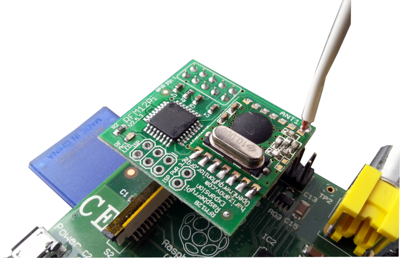
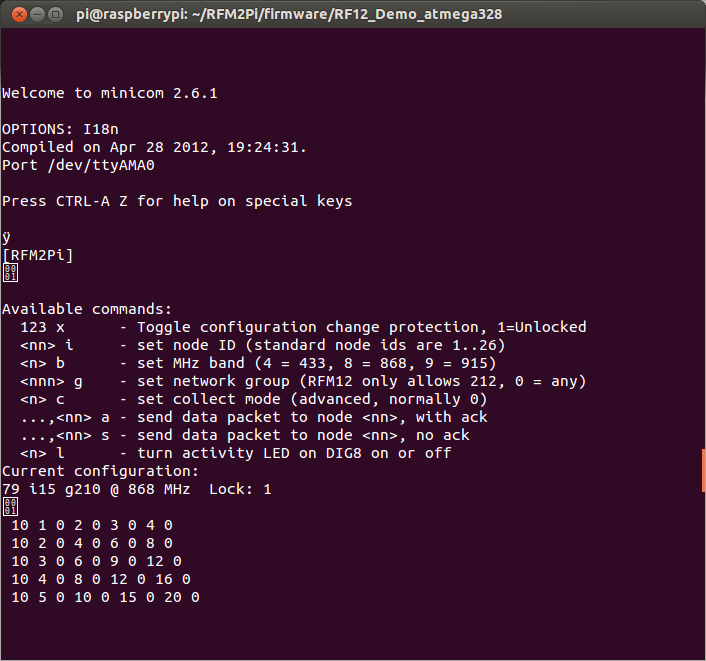

## RFM12Pi V2

The RFM12Pi enables the Raspberry Pi to receive wireless data from the RFM12B wireless module.



*Development of the RFM12Pi has been a team effort between [Martin Harizanov](http://harizanov.com/) and Glyn Hudson.*

The RFM12Pi V2 consists of an [RFM12B wireless module](http://openenergymonitor.org/emon/buildingblocks/rfm12b-wireless) and an ATmega328 microprocessor running the OptiBoot serial bootloader (modified for an 8MHz internal oscillator) which is Arduino compatible.

The ATmega328 runs a [modified](https://github.com/mharizanov/RFM2Pi/blob/master/firmware/RF12_Demo_atmega328/RF12_Demo_atmega328.ino)
version of [JeeLabs's RF12Demo](https://github.com/jcw/jeelib/tree/master/examples/RF12/RF12demo).
Raw wireless packets are passed to the Pi via the Pi's internal UART serial port. The raw packets are processed by the [emoncms Raspberry Pi module](https://github.com/emoncms/raspberrypi) or [python emoncms gateway](https://github.com/emoncms/docs/blob/master/raspberrypigateway.md)
See emoncms documentation on [emoncms.org](http://emoncms.org/site/docs/raspberrypi) for detailed documentation regarding setting up and running emoncms on a Raspberry Pi with an RFM12Pi.

### Technical Overview

  - ATmega328 based, has more memory and hardware serial support
  - Runs on the internal 8Mhz oscillator (to save unnecessary components)
  - SMT components. Board layout is optimized for pick-and-place assembly
  - Lower profile to fit inside most Raspberry Pi enclosures
  - The new RFM12Pi with ATmega328 allows programming directly from Raspberry Pi using avrdude (..and OptiBoot)

### RFM12Pi V2 Setup

The RFM12Pi V2 can be purchased pre-assembled and ready flashed with firmware from the \[shop.openenergymonitor.com/raspberry-pi/ OpenEnergyMonitor shop\]. No assembly or setup is needed.

See [Raspberry Pi documentation on emoncms.org](http://emoncms.org/site/docs/raspberrypiimage) for pre-built emoncms Raspberry Pi read-to-go SD card & Pi setup instructions.

If you have assembled the RFM12Pi yourself or wish to re-flash the firmware, this can be done using the ISP header and a ISP programmer. See [\#Flashing the Bootloader](#Flashing_the_Bootloader "wikilink")

#### Upgrading RFM12Pi Firmware Direct from the Pi

Since the Raspberry Pi lacks a DTR pin that makes it oh-so-easy to
upload your hex files into the avr, we need this hack to make it just as
easy. Thanks to JCW from JeLabs for working this out and Martin
Harizanov for implementing it for the RFM12Pi.

<code>

    $ sudo apt-get update 
    $ sudo apt-get install arduino
    $ sudo apt-get install python-dev&&python-rpi.gpio
    $ git clone https://github.com/mharizanov/avrdude-rpi.git
    $ cd avrdude-rpi
    $ sudo cp autoreset /usr/bin
    $ sudo cp avrdude-autoreset /usr/bin
    $ sudo mv /usr/bin/avrdude /usr/bin/avrdude-original
    $ sudo ln -s /usr/bin/avrdude-autoreset /usr/bin/avrdude
    $ cd /home/pi
    $ git clone https://github.com/openenergymonitor/RFM2Pi
    $ cd RFM2Pi/firmware/RF12_Demo_atmega328
    $ sudo service emonhub stop
    $ avrdude -v  -c arduino -p ATMEGA328P -P /dev/ttyAMA0 -b 38400 -U flash:w:RF12_Demo_atmega328.cpp.hex
    $ sudo service emonhub start

</code>

*Update: Paul has made a modified version of avrdude autoreset which
does not conflict with uploads via serial UART. It kicks in only when
uploading to ttyAMA0 and gives a confirmation message to inform the user
which gpio pin is being used for DTR (reset):
<https://github.com/pb66/avrdude-rpi>. Forum thread
<http://openenergymonitor.org/emon/node/6121>*

#### Flashing the Bootloader

**The ATmega328 should come pre-loaded with the Optiboot bootloader and
RFM12Pi firmware, this step should not be required unless you assembled
the RFM12Pi with a blank ATmega328.**

*Note: the RFM12Pi is a 3.3V device. It should not be powered by a 5V ISP programmer.*

To avoid accidental connection to 5V, the VCC pin on the ISP header is
by default, disconnected. A jumper connection between the two adjacent
pads must be made to connect the ISP VCC to the board VCC. On some ISP
programmers, (such as the AVR MKII that I use) the VCC pin needs to be
connected to initialise the programmer even though the programmer itself
does not power the board. An easy way to power the board with 3.3V for
programming, is to connect it onto the Pi's GPIO. Take care to align pin
1 properly.

The stock RFM12Pi firmware can be downloaded in pre-compiled .hex form
from github
[here](https://github.com/mharizanov/RFM2Pi/blob/master/firmware/RF12_Demo_atmega328/Optiboot328_8MHz_RF12_Demo.hex).
This pre-compiled .hex file contains both the optiboot bootloader and
the modified RF12Demo Sketch.

The .hex file can be flashed, and the fuses set, on the ATmega328 using
the following avrdude command:

<code>

    $ sudo avrdude -v -p atmega328p -c avrispmkII -P usb -e -Ulock:w:0x3F:m -Uefuse:w:0x05:m -Uhfuse:w:0xDE:m -Ulfuse:w:0xE2:m -U flash:w:Optiboot328_8MHz_RF12_Demo.hex:i -B 10

</code>

If you want to read the data from the ATmega328 (e.g to make a backup)
that can be done with:

<code>

``` 
 $ avrdude -v -p atmega328p -c avrispmkII -P usb -U flash:r:test_intel.hex:i
```

</code>

Alternatively, you could flash the modified Optiboot bootloader, then
upload the RF12\_Demo\_atmega328.cpp.hex to RFM12Pi direct from the Pi.
See below for instructions on how to modify the OptiBoot bootloader, and
above, for instructions on how to upload direct from the Pi, once the
bootloader is in place.

##### Modified OptiBoot Bootloader

The ATmega328 gets its clock from the the internal 8Mhz oscillator. This
requires a special version of Optiboot optimised for 38.4 kbps. The
modified and compiled version can be obtained at: [downloaded from
Martin's
github](https://github.com/mharizanov/RFM2Pi/tree/master/firmware/RF12_Demo_atmega328).

The full guide on how to modify and re-compile Optboot is detailed on
the Arduino forum
[here](http://arduino.cc/forum/index.php?topic=124879.0).

In order to compile Arduino sketches to work for this modified
bootloder, we need to add a new entry in
arduino-1.0.2\\hardware\\arduino\\boards.txt.

    atmega328_384_8.name=ATmega328 Optiboot @ 38,400baud w/ 8MHz Int. RC Osc.
    
    atmega328_384_8.upload.protocol=arduino
    atmega328_384_8.upload.maximum_size=30720
    atmega328_384_8.upload.speed=38400
    
    atmega328_384_8.bootloader.low_fuses=0xE2
    atmega328_384_8.bootloader.high_fuses=0xDE
    atmega328_384_8.bootloader.extended_fuses=0x05
    atmega328_384_8.bootloader.path=optiboot
    atmega328_384_8.bootloader.file=optiboot_atmega328_384_8.hex
    atmega328_384_8.bootloader.unlock_bits=0x3F
    atmega328_384_8.bootloader.lock_bits=0x0F
    
    atmega328_384_8.build.mcu=atmega328p
    atmega328_384_8.build.f_cpu=8000000L
    atmega328_384_8.build.core=arduino
    atmega328_384_8.build.variant=standard

Now we need to select board \> ATmega328 Optiboot @ 38,400baud with 8MHz
Internal RC Osc in the Arduino IDE when compiling sketches.

### Design Files & Reference

The board schematic and layout (in Eagle CAD format) are available on
the[OpenEnergyMonitor Hardware
GitHub](https://github.com/openenergymonitor/Hardware/tree/master/RFM2Pi)

The Arduino compatiable firmware is available on the [OpenEnergyMonitor
Github:](https://github.com/openenergymonitor/RFM2Pi/tree/master/firmware/RF12_Demo_atmega328)

[Martin Harizanov's original blog post introducing the RFM12Pi
V2](http://harizanov.com/2013/02/new-rfm2pi-board-in-the-works/)


### Debugging

Minicom can be used to view the RFM12Pi serial output via the Pi's
internal serial port. If you're running a stock Raspbian image, you will
need to enable access to ttyACM0, the internal UART serial port which
the RFM12Pi uses. To do this, see instruction here:

<https://github.com/lurch/rpi-serial-console>

Next, stop any process that's using the serial port by either

`$ sudo service rfm12piphp stop`

if you're using the rfm21piphp service, or, if you're using the
rock-solid read-only gateway,

<code> $ ps -ef | grep python

$ kill -9 xxxx</code>

replace xxxx with the PID of your python script process.

<code> $ sudo apt-get install minicom

$ minicom -b9600 -D/dev/ttyAMA0</code>

\[CTRL + A\] then \[X\] to exit minicom

If all is working well, you should see the following when the RFM12pi is
connected to the Pi's GPIO. Note the packets being received from Node 10
(emonTx).

**The default Frequency of the RFM12pi is 868Mhz, group 210 and node ID
15**.

These parameters can be changed in software by issuing the correct
serial commands as illustrated below



### Hacks, Modifications & Extensions

#### Controlling RF Plugs

Thanks to Paul Tanner the RFM12Pi V2 has successfully been used to
control (switch on/off) KAKU mains plugs via wireless OOK protocol.

The KAKU protocol is built into the RF12 demo, however the default
firmware (currently as of July 2013) on the RFM12Pi uses a [cut down
version](https://github.com/mharizanov/RFM2Pi/blob/master/firmware/RF12_Demo_atmega328/RF12_Demo_atmega328.ino)
of the RF12 demo. In order to use the full functionality of the RF12
demo including the OOK KAKU protocol the firmware on the ATmega328 needs
to be upgraded. We have released a version of the full RF12 demo which
as been customised for the RF12Pi (baud rate, turn off bad packet
reporting and "OK" printing). This firmware is available on github
[here](https://github.com/mharizanov/RFM2Pi/tree/master/firmware/Full_RF12demo_atmega328).

The firmware can be updated direct from the pi by following the
instructions above but specifying the Full\_RF12demo\_atmega328.cpp.hex
in the avrdude commandline.

See the [original forum
thread](http://openenergymonitor.org/emon/node/2245) with full upgrading
instructions from Paul if you're not running the pre-built emoncmspi SD
card.

#### Using RFM12Pi with a BeagleBoard Black

Thanks for forum member
[Docin](http://openenergymonitor.org/emon/user/5403), it's possible to
use the RFM12Pi on BeagleBoard Black

<http://mymiscellaneoustricks.wordpress.com/2014/02/15/rfm12pi/>

Upgrading RFM12Pi firmware from BeagleBoard Black:

<http://mymiscellaneoustricks.wordpress.com/2014/02/16/mise-a-jour-du-firmware-du-rfm12pi/>
<http://mymiscellaneoustricks.wordpress.com/2014/02/16/mise-a-jour-du-firmware-du-rfm12pi/>\]
