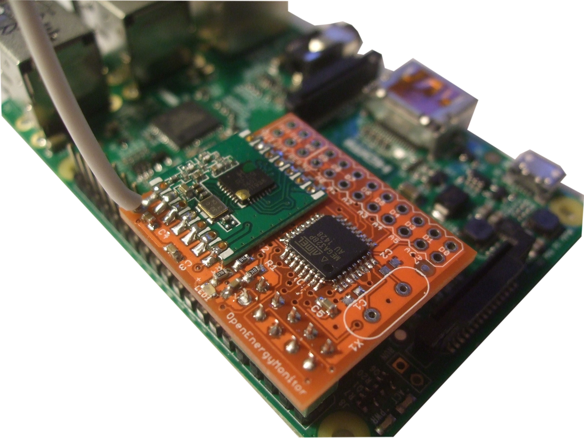

# RFM69Pi V3
 


Development of the RFM69Pi has been a team effort between Martin Harizanov, Glyn Hudson and Ken Boak.

The RFM69Pi enables the Raspberry Pi to receive data from other RFM69CW or RFM12B (backward compatible) wireless modules

The RFM69Pi V3 consists of an [RFM69CW wireless module](http://openenergymonitor.org/emon/buildingblocks/rfm69cw) and an ATmega328 microprocessor running the OptiBoot serial bootloader (modified for 8MHz internal oscillator) which is Arduino compatible. See [our blog post](http://openenergymonitor.blogspot.com/2014/12/introducing-rfm69cw.html) introducing the new RFM69CW module. 

The ATmega328 runs a [modified](https://github.com/openenergymonitor/RFM2Pi/blob/master/firmware/RFM69CW_RF_Demo_ATmega328/RFM69CW_RF12_Demo_ATmega328/RFM69CW_RF12_Demo_ATmega328.ino) version of [JeeLabs's RF12Demo](https://github.com/jcw/jeelib/tree/master/examples/RF12/RF12demo). 
Raw wireless packets are passed to the Pi via the Pi's internal serial port. 

## Technical Overview

- ATmega328 based, has more memory and hardware serial support
- Runs on the internal 8Mhz oscillator (to save unnecessary components)
- SMT components.
- Lower profile to fit inside most Raspberry Pi enclosures
- The new RFM2Pi with ATmega328 allows programming directly from Raspberry Pi using avrdude (..and OptiBoot)
- Communicates with Raspberry Pi via /dev/ttyAMA0 at 38400 bps

## RFM69Pi V3 Setup===

The RFM69Pi V3 can be purchased pre-assembled and pre-loaded with firmware from the [OpenEnergyMonitor shop](http://shop.openenergymonitor.com/raspberry-pi). No assembly or setup required.

Communication with the RFM69Pi on the Raspberry Pi is handled by [the emonHub Python service](https://github.com/emonhub/emonhub). Using emonHub, received RF data can be posted to one or more Emoncms servers or another internet service. 

If you have assembled the RFM69Pi, or wish to update/reflash the Arduino based firmware, that can be done using the ISP header and a ISP programmer. See [[#Flashing the Bootloader]]

## Communicating Directly with the RFM69Pi

The RFM69Pi communicates with Raspberry Pi via /dev/ttyAMA0 at 38400 bps. The Raspberry Pi's serial console must be disabled to enable the RFM69Pi serial communication:

    sudo wget https://raw.github.com/lurch/rpi-serial-console/master/rpi-serial-console -O /usr/bin/rpi-serial-console && sudo chmod +x /usr/bin/rpi-serial-console
    sudo rpi-serial-console disable
    sudo reboot
    rpi-serial-console status

You should see the message *Serial console on /dev/ttyAMA0 is disabled*, the serial port is now free for communication with the ATMega328 on the RFM69Pi

Minicom can be used to view the serial output of the RFM69Pi direcly:

    sudo apt-get install minicom
    minicom -b38400 -D/dev/ttyAMA0

[CTRL + A] then [X] to exit minicom

## Raspberry Pi 3 Compatibility

The emonPi communicates with the RasPi via GPIO 14/15 which on the Model B,B+ and Pi2 is mapped to UART0. However on the Pi3 these pins are mapped to UART1 since UART0 is now used for the bluetooth module. However UART1 is software UART and baud rate is dependant to clock speed which can change with the CPU load, undervoltage and temperature; therefore not stable enough. One hack is to force the CPU to a lower speed ( add `core_freq=250` to `/boot/cmdline.txt`) which cripples the Pi3 performance. A better solution for the emonPi is to swap BT and map UART1 back to UART0 (ttyAMA0) so we can talk to the emonPi in the same way as before.

RasPi 3 by default has bluetooth (BT) mapped to /dev/AMA0. To allow use to use high performace hardware serial (dev/ttyAMA0) and move bluetooth to software serial (/dev/ttyS0) we need to add an overlay to config.txt. See /boot/overlays/README for more details. See [this post](https://spellfoundry.com/2016/05/29/configuring-gpio-serial-port-raspbian-jessie-including-pi-3) for RasPi3 serial explained.

    sudo nano /boot/config.txt

Add to the end of the file

    dtoverlay=pi3-miniuart-bt

We also need to run to stop BT modem trying to use UART

    sudo systemctl disable hciuart

See RasPi device tree commit for pi3-disable-bt and forum thread discussion

Reboot then test serial comms with:

    sudo minicom -D /dev/ttyAMA0 -b38400

You should see data from emonPi ATmega328, sending serial v should result in emonPi returning it's firmware version and config settings.

To fix SSHD bug (when using the on board WiFi adapter and NO Ethernet). Edit /etc/ssh/sshd_config and append:

    IPQoS cs0 cs0

## Upgrading RFM69Pi Firmware Direct from the Pi

Since the Raspberry Pi lacks a DTR pin that makes it oh-so-easy to upload your hex files to the AVR, we need this hack to make it just as easy. Thanks to JCW from JeLabs for working this out, and Martin Harizanov for implementing it on the RFM12Pi.

The RFM69Pi uses GPIO Pin 4 (BCM) as the DTR reset pin.

    # Install avrdude, and GPIO auto reset
    sudo apt-get update
    git clone https://github.com/openenergymonitor/avrdude-rpi.git ~/avrdude-rpi && ~/avrdude-rpi/install

    # Grab latest firmware for RFM69Pi and perform the upload via serial 
    git clone https://github.com/openenergymonitor/RFM2Pi.git
    cd RFM2Pi/firmware/RFM69CW_RF_Demo_ATmega328/
    sudo service emonhub stop
    avrdude -v -c arduino -p ATMEGA328P -P /dev/ttyAMA0 -b 38400 -U flash:w:RFM69CW_RF12_Demo_ATmega328.cpp.hex
    sudo service emonhub start

## Flashing the Bootloader

The ATmega328 on the RFM69Pi should come pre-loaded with the Optiboot bootloader and RFM69Pi firmware. This step should not be required unless you have assembled the RFM69Pi with a blank ATmega328.

Note: the RFM69Pi is a 3.3V device. It should not be powered by a 5V ISP programmer.

The stock RFM69Pi firmware can be downloaded in pre-compiled .hex form from github [here](https://github.com/openenergymonitor/RFM2Pi/tree/master/firmware/RFM69CW_RF_Demo_ATmega328). This pre-compiled .hex file contains both the optiboot bootloader and the modified RF12Demo Sketch. 


The .hex file can be flashed, and the fuses set, on the ATmega328 using the following avrdude command:  

    sudo avrdude -v -p atmega328p -c avrispmkII -P usb -e -Ulock:w:0x3F:m -Uefuse:w:0x05:m -Uhfuse:w:0xDE:m -Ulfuse:w:0xE2:m -U flash:w:Optiboot328_8MHz_RFM69CW_RF12_Demo_ATmega328.cpp.hex:i -B 10

If you want to read the data from the ATmega328 (e.g to make a backup) that can be done with:

    avrdude -v -p atmega328p -c avrispmkII -P usb -U flash:r:test_intel.hex:i

Alternatively, you could flash the modified Optiboot bootloader, then upload the RF12_Demo_atmega328.cpp.hex to RFM69Pi direct from the Pi. See below for instructions on how to modify the OptiBoot bootloader, and above, for instructions on how to upload direct from the Pi once the bootloader is in place. 

A final alternative is to create a board

##  Modified OptiBoot Bootloader

The ATmega328 gets its clock from the the internal 8Mhz oscillator. This requires a special version of Optiboot optimised for 38.4 kbps. The modified and compiled version can be obtained at: [ from Martin's github](https://github.com/mharizanov/RFM2Pi/tree/master/firmware/RF12_Demo_atmega328). The firmware for RFM69Pi also includes the modified Optiboot bootloader, so you can burn the unit with this to begin with. It is available from Martin's github site and [in this repository under Firmware](https://github.com/openenergymonitor/RFM2Pi/tree/master/firmware/RFM69CW_RF_Demo_ATmega328) as mentioned above. The bootloader should be placed in arduino-arduino-1.x.x\hardware\arduino\bootloaders or ...\arduino\hardware\avr\1.x.x\bootloaders for some operatings systems.

The full guide on how to modify and re-compile Optboot is detailed on the Arduino forum [here](http://arduino.cc/forum/index.php?topic=124879.0).

In order to compile Arduino sketches to work for this modified bootloader, we need to add a new entry in arduino-1.x.x\hardware\arduino\boards.txt or ...\arduino\hardware\avr\1.x.x\boards.txt for some operatings systems. If you will also burn the bootloader from Arduino IDE, the mega328_384_8.bootloader.file setting should match the filename of the bootloader you placed in the bootloaders directory.

```
atmega328_384_8.name=ATmega328 Optiboot @ 38,400baud w/ 8MHz Int. RC Osc.

atmega328_384_8.upload.tool=avrdude
atmega328_384_8.upload.tool.default=avrdude
atmega328_384_8.upload.tool.network=arduino_ota
atmega328_384_8.upload.protocol=arduino
atmega328_384_8.upload.maximum_size=30720
atmega328_384_8.upload.speed=38400

atmega328_384_8.bootloader.tool=avrdude
atmega328_384_8.bootloader.tool.default=avrdude
atmega328_384_8.bootloader.low_fuses=0xE2
atmega328_384_8.bootloader.high_fuses=0xDE
atmega328_384_8.bootloader.extended_fuses=0x05
atmega328_384_8.bootloader.path=optiboot
atmega328_384_8.bootloader.file=optiboot_atmega328_384_8.hex
atmega328_384_8.bootloader.unlock_bits=0x3F
atmega328_384_8.bootloader.lock_bits=0x0F

atmega328_384_8.build.mcu=atmega328p
atmega328_384_8.build.f_cpu=8000000L
atmega328_384_8.build.core=arduino
atmega328_384_8.build.variant=standard
atmega328_384_8.build.board=AVR_UNO
```

Now we need to select: Board > ATmega328 Optiboot at 38,400 bps with 8MHz Internal RC Osc in the Arduino IDE when compiling sketches.

## Design Files & Reference

The board schematic, layout (in Eagle CAD format) are available in this repo.


## Debugging

Minicom can be used to view the RFM69Pi serial output via the Pi's internal serial port. If you're running a stock Raspbian image, you will need to enable access to ttyACM0 the internal UART serial port which the RFM69Pi uses. To do this, see instructions here:

[https://github.com/lurch/rpi-serial-console](https://github.com/lurch/rpi-serial-console)

    sudo apt-get install minicom
    minicom -b38400 -D/dev/ttyAMA0

[CTRL + A] then [X] to exit minicom

If all is working well, you should see the following when the RFM69Pi is connected to the Pi's GPIO:


    [RF12demo.12] O i15 g210 @ 433 MHz q1
    OK 10 129 0 0 0 0 0 0 0 55 93 200 0 0 0 0 0 0 0 0 0 0 0 0 0 (-65)


Note the packets being received from Node 10 (emonTx). Send the command 'v' to return firmware version and RF settings.

The default Frequency of the RFM69Pi is 433Mhz, group 210 and node ID 15. 

Send the command 'p' to return a list of available commands:

````
Available commands:
  <nn> i     - set node ID (standard node ids are 1..30)
  <n> b      - set MHz band (4 = 433, 8 = 868, 9 = 915)
  <nnnn> o   - change frequency offset within the band (default 1600)
               96..3903 is the range supported by the RFM12B                    
  <nnn> g    - set network group (RFM12 only allows 212, 0 = any)
  <n> c      - set collect mode (advanced, normally 0)
  t          - broadcast max-size test packet, request ack
  ...,<nn> a - send data packet to node <nn>, request ack
  ...,<nn> s - send data packet to node <nn>, no ack
  <n> q      - set quiet mode (1 = don't report bad packets)
  <n> x      - set reporting format (0: decimal, 1: hex, 2: hex+ascii)
  123 z      - total power down, needs a reset to start up again
Remote control commands:
  <hchi>,<hclo>,<addr>,<cmd> f     - FS20 command (868 MHz)
  <addr>,<dev>,<on> k              - KAKU command (433 MHz)
Current configuration:
 E i5 g210 @ 433 MHz
```

These parameters can be changed in software by issuing the correct serial commands e.g b4 for 433Mhz, 210g for 210 network group.

**Example commands:**

* '8b' - set frequency to 868 (default 433)
* '210g' - set group to 210 (default)
* '1q' - turn off quite mode (don't return bad packets '?')

